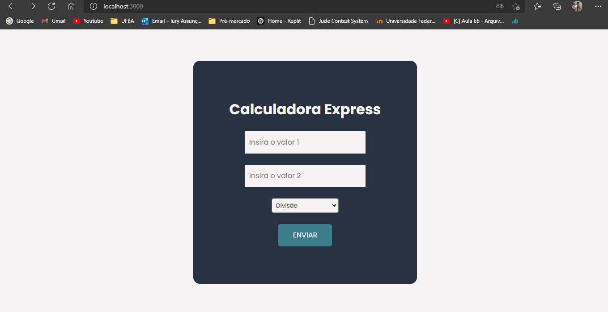

<h1 align="center"> Calculadora Express</h1>
<br>
<br>

<div></div>
<br>

<hr>

<br><br>
<h1> Sobre 🔖</h1>

<p>

O projeto Calculadora Express tem por objetivo introduzir tecnologias relativas ao back-end, Node.js e Express.js, para a criação de um ambiente de execução Javascript server-side. A calculadora deve realizar as 4 operações matemáticas básicas utilizando parâmetros de rota.

Existem quatro valores de operação que um usuário pode usar: adição, subtração, multiplicação e divisão. O formato da rota a ser usado é http: // localhost: 3000 /: operador /: numero1 /: numero2.

Quando essa rota é atingida, seu navegador deve exibir o resultado da operação matemática e os dois números na tela. Por exemplo:

- Quando o usuário acessar http: // localhost: 3000 / adicionar / 10 / 1, a página deve exibir 11,
- Quando o usuário acessar http: // localhost: 3000 / subtrair / 8.5 / 0.5, a página deve exibir 8,
- Quando o usuário acessar http: // localhost: 3000 / multiplicar / 3.7 / 2.5, a página deve exibir 6.2
- Quando o usuário acessar http: // localhost: 3000 / dividir / 6 / 3, a página deve exibir 2

Além de ser possível colocar os valores direto na URL, é preciso haver uma opção de enviar os valores através da página principal, através de um formulário simples no qual se escolhem 2 números e a operação a ser executada.
</p>

<h1> Tecnologias Utilizadas 🚀</h1>

<h3>
 • <a href="https://developer.mozilla.org/pt-BR/docs/Web/HTML">HTML</a> <br>
 • <a href="https://developer.mozilla.org/pt-BR/docs/Web/CSS">CSS</a> <br>
 • <a href="https://developer.mozilla.org/pt-BR/docs/Web/JavaScript">JS</a> <br>
 • <a href="https://nodejs.org/en/">Node.js</a> <br>
 • <a href="https://expressjs.com/pt-br/">Express</a> <br>
 • <a href="https://www.npmjs.com">NPM</a> 
 
</h3>


<h1> Instalação e execução 🔧</h1>


<p>Para baixar o projeto siga as instruções abaixo:</p>

```
1. git clone https://github.com/iury-assuncao/CalculadoraExpress.git
```

<p> Acesse o repositório </p> 

```
2. cd CalculadoraExpress
```
<p> Instale as dependências </p>

```
3. npm install
```
<p> Inicie o servidor </p>

```
4. npm run dev
```
